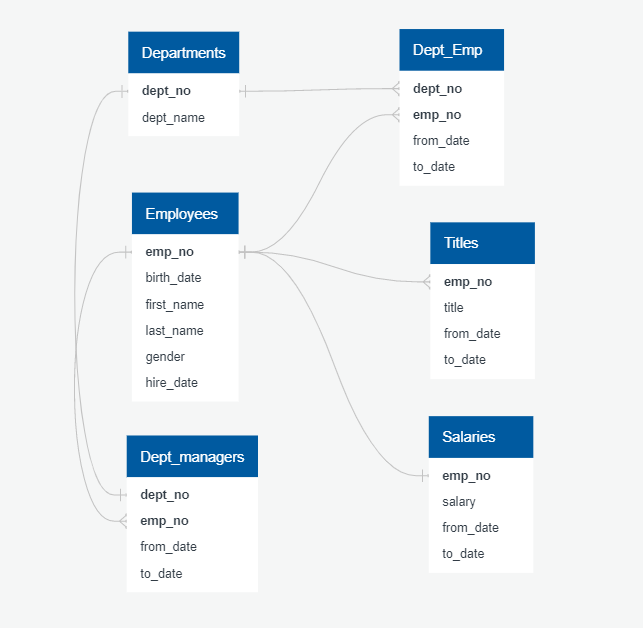
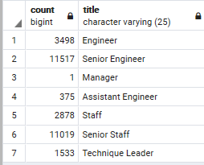

# Pewlett_Hackard_Analysis

# Module 

The goal of this module was to learn about data modeling, analysis, and analysis. We created an entity relational diagram (ERD), imported into a database, addressed errors, created queries to answer data specific questions. To start this exercise, we downloaded the tools of PostgreSQL and pgAdmin. We used Postgres to create database, and pgAdmin to work with the data he’ll be importing. We began by creating tables and importing data into the 6 tables in the database. From there, we helped Bobby determine how many people will be retiring, and of those employees, who is eligible to retire.

We determined the retirement eligibility to individuals that were born between 1952 and 1955  narrowing the search for hire date to be between 1985 and 1988. Next, we used joins to put tables together and specified which columns we liked to see joined. Using Left join, we created information by combining the retirement_info and dept_employee. In addition, we used the group by function to group by certain fields in our tables. We identified the list of employees who would be good candidates for a supervisory role and would be born in 1965

# Challenge
The goal of this challenge is to use the joins and queries we learned in this module to create a list of mentorship program. To create the list of potential mentors, we created a query that returns a list of current employees  eligible for retirement, and their most recent title. To get the recent titles, we used the partition method so that each employee is included in the list once. Then, the final query returned the mentor's employee number, first, last name, their title, brith date and employment dates. 

Using the ERD, we were able to see the relationshipd between the six different tables. The ERD tells us the relationship between the 6 tables:

- Departments and Dep_Emp have a one to many relationship.These two have the dept_no as a common column which we used for our analysis.
- Departments and Managers have a one to one relationship. These two have department the dept_no in common.
- Employees and Dept_Emp have a one to many retionship. These two have the emp_no as a common column.
- Employees and Titles have one to many relationship. These two have emp_no as a common column.
- Employees and Salaries have a one to one realtionship. These two have empo_no as a common column. 

As we started quearing our flies, we began to think about the commonlities between these tables. 

Number of title Retiring 

We created a table to include emp_no, first name, last name, title, from_date, and salary. Using the inner join, we combined the two tables (employees and titles). We resticted the date to BETWEEN '1952-01-01' AND '1955-01-01' to find the number of people that are retiring and used a hire date between '1985-01-01' AND '1988-12-31' as another condition to get the recent titles of retiring.
Results can be found in the csv file named retiringtitles_challenge. 

In addition, we created the most recent titles excluding duplicate data using the partitioning method.Since we noticed that there were duplucated rows in our data, we account for the duplicate rows. We used a with statment to delete duplicates and created a table below.

Lastly, we created a table for who is ready to be a mentor. The new table will contains employee information such as emp_no, first name, last name, title, from_date, and to_date. We created a csv file to tell us the list of mentors. 

